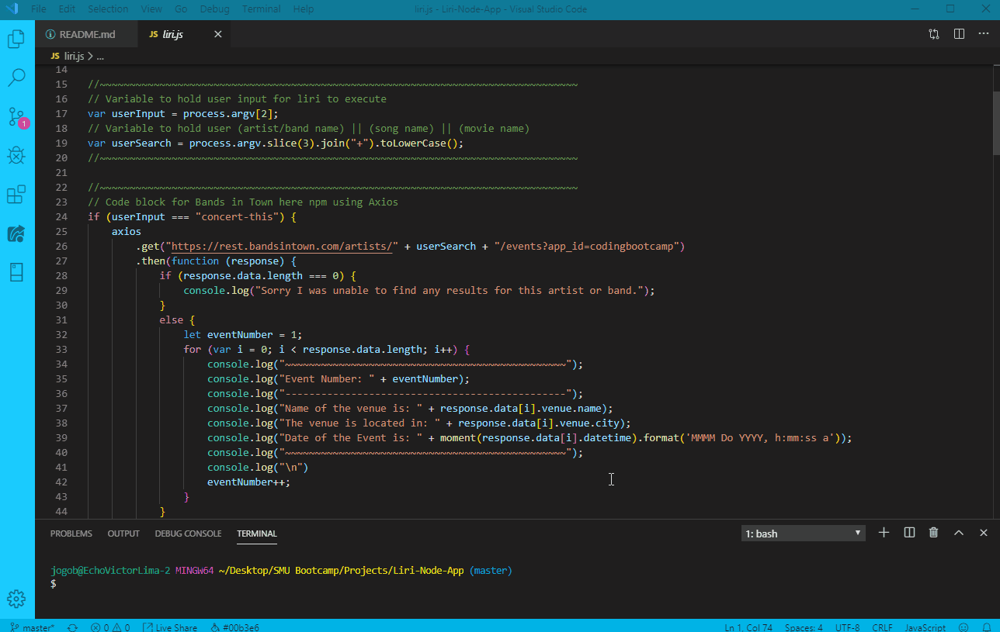
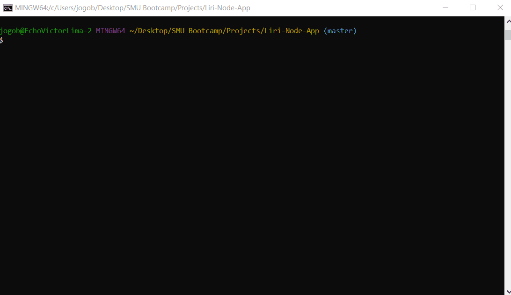

# Liri Node App

LIRI is a _Language_ Interpretation and Recognition Interface. LIRI is a command line node app that takes in parameters and gives you back data.

## Technologies Used
- JavaScript
- Node.js
- RESTful API Calls
- Terminal to run app

## What Liri can do

* Search Spotify for songs.
* Bands in Town for concerts.
* OMBD for movies.
* Additionally, if the user does not search for anything, Liri will automatically make a search for the user

### Organization in liri.js file

1. Code to required for npm packages used.
2. Code to hold user input and searches
3. If else code that executes app based off the user input

### How To run app

* App has to be run on the command terminal
* There are four inputs that a user can type in terminal for Liri to execute
  #### Search Bands in Town for concerts/events.
  1. $ node liri.js concert-this 'artist name or band name'
  
  #### Search Spotify for songs.
  2. $ node liri.js spotify-this-song 'song name'
  #### Search OMBD for movies.
  3. $ node liri.js movie-this 'movie name'
  #### Search with missing field
  4. $ node liri.js 